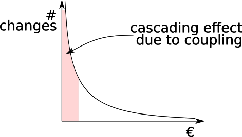
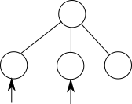
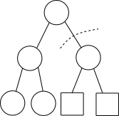
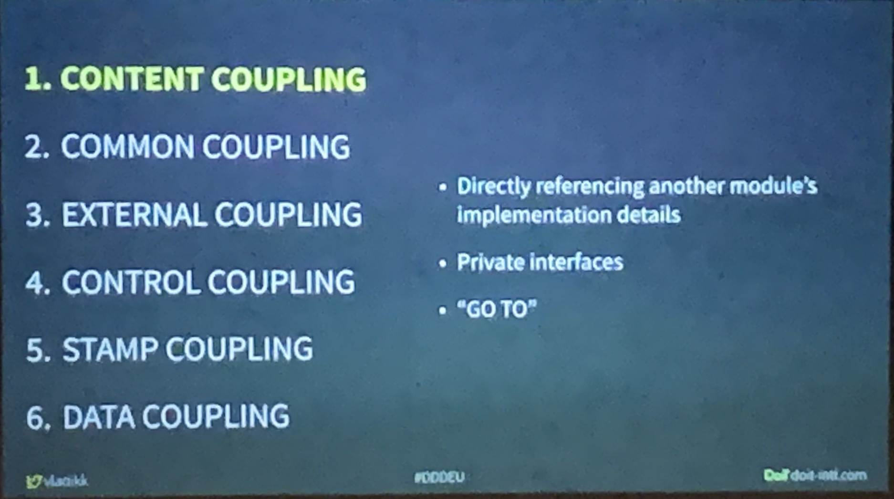
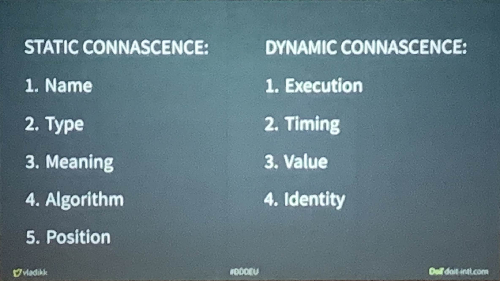
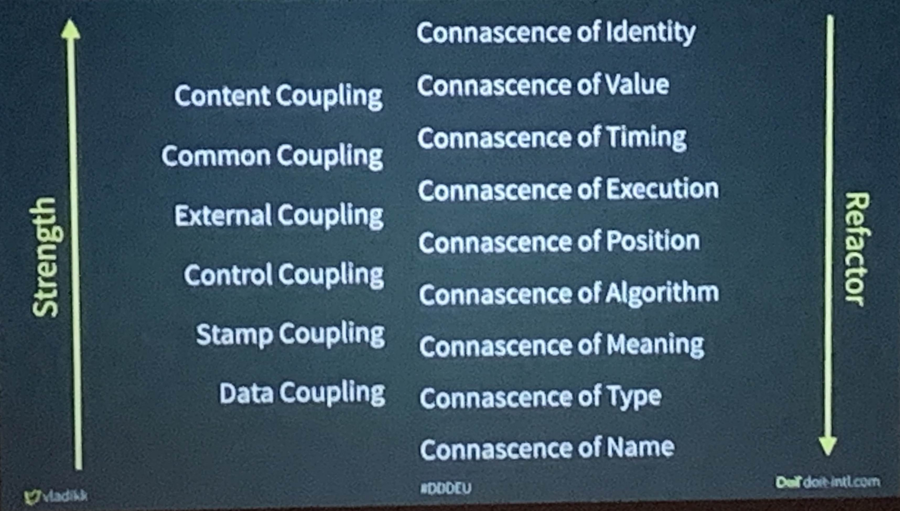
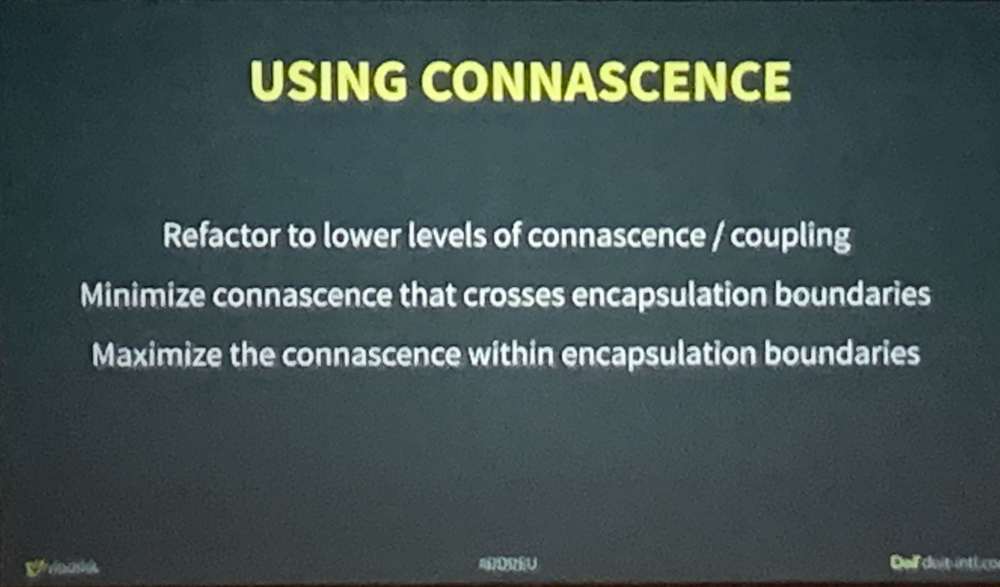
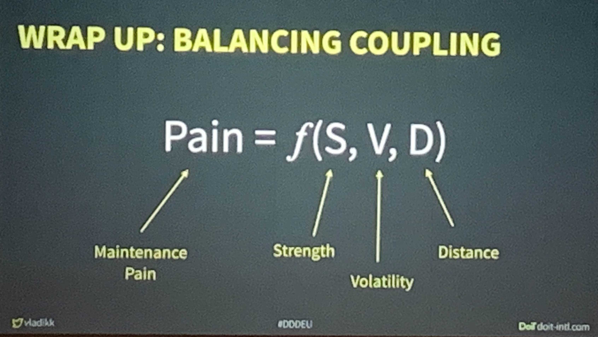

# Notes from DDD-EU 2020

## General Observations

Dominating areas of development that showed up rather often

- Wardley maps
- coupling and connascence
- heuristics
- team relations

## Heuristics workshop - Rebecca Wirfs-Brock

Collect and share your heuristics. Every traveller improves the trail by a little bit.

Types of Bounded Contexts

- quaint
- bubble
- autonomous bubble
- octopus
  - Nick Tune
  - Matias Verraes
  TODO: Research types

Interesting: bounded context canvas by Nick Tune

- Should idealy hang in the team room

Interesting: Jabe Bloom's work on using Wardley maps for architecture

Lead by example on team processes like

- putting stickies
- tearing stickies of the wall and dumping them

Pointing something out by using color or arranging it to have space around it helps the team to focus on figuring out a solution

When splitting teams, nudge them apart by separate rhythms and events along the seams thart start to show up. (Jason Yip)

Value consistency over clevernes

Interesting: Paul Graham - 6 Levels of argumentation

Work with a decision budget to move a team forward

Interesting: development guidelines by Earth Observations Laboratory contain lots of useful heuristics

Be suspicious of CRUD-verbs in method names in DDD

Separate events for separate downstream processes

Don't design messages or events for specific consumers

Interesting: Matias Verraes heuristics from the distlling session with Rebecca have in part been published on his website. Also Rebecca and Kenny plan to publish more heuristics on the design heuristics website.

Interesting: strangle pattern by Fowler

Interesting: Nick Tunes work on strategic design (types of contexts)

Agile processes don't really plan for end of life of features and code.

Interesting: how much diversity do you want?

- report at Agile Alliance website
- also in agile Alliace experience podcast

 Interesting: fearless change patterns

 Interesting: talk - bring out the good stuff

 Examine team velocity under the aspect of direction

 Mapping

- on the wall: time structured
- floor: landscape structured

 Interesting: virtual DDD Youtube channel

 Interesting: model exploration whirlpool

 Interesting: Christian Kohls inovation patterns

 Interesting: A Scrum Book; Sutherland et al.

 TODO: look up event storming with example map

 Defer naming aggregates to the most responsible moment

 Interesting: blog article by cucumber team abou remote mobbing

## Blink Modeling - Eric Evans

 If the domain expert does not answer the question process the information you get and return to your original question after.

 Ask "What do you call it if ... scenario?" in order to extract vocabulary

 Make examples concrete

 Engine as a term for a subsystem that does something

## Dissecting Bounded Contexts - Nick Tune

 Modularity

- limit cognitive load
- team autonomy
- fine grained ROI-aligned investment
- granular customizing
- containment

What is core will change over time.

- e.g. Slack started out as an internal chat tool

Question your domain structure to keep your competitive edge

Decouple and align biz and tech structure.

Interesting: book Team Topologies

Social architecture is more fluid than tech architecture.

Teams should be able to select their work by themselves

Interesting: concept supercontext

Interesting: Dynamic Reteaming

Interesting: Model Archetypes by Alberto Brandolini

Interesting: Messaging Patterns by Mathias Verraes

## Visualizing sociotechnical architectures with Context Maps - Michael Plöd

Decentralize governance aspects for autonomy and speed

You design it, you build it, you run it

Interesting: book The architect's elevator

## A different take on (context) mapping - Marijn Huizenveld

Maps make assumptions explicit

Be aware of systems bias which tends to push towards early stuctured modelling.

- not user centered
- alternative: event storming

Mapping is more important than maps

Wardley maps for context mapping.

## "Nothing will ever be the same" - Avram Poupko

Solution complexity > domain complexity

Domain models include a theory about the changes the domain will undergo with the introduction the software.

Dig into always and never rules understand contexts and limitations.

## Continued Learning: The beauty of maintenance - Kent Beck

Software changes its requirements the moment is is being used because it changes the process.

Definition of coupling:

Coupled(A,B, &Delta;)::&Delta;A&rArr;&Delta;B

Total cost &asymp; Cost of change

The more complicated the system the more likely is unexpected coupling.

Clear inputs and outputs help with undesired coupling.

Cohesion

Decoupling can be expensive. Improving cohesion is often easy.

Make a change easy then make an easy change

Experiment: Carefully separate structure an behavior change into different commits

- either one can be first
- behaviour changes are irreversible
- structure are reversible

Interesting: Kent's 3 X model

Big feedback loops come back into fashion. DDD community needs to watch out to keep the feedback loop small.

## Balancing Coupling in Distributed Systems - Vladik Khonokov

Coupling is part of system design. Which changes do I want to allow/restrict.

